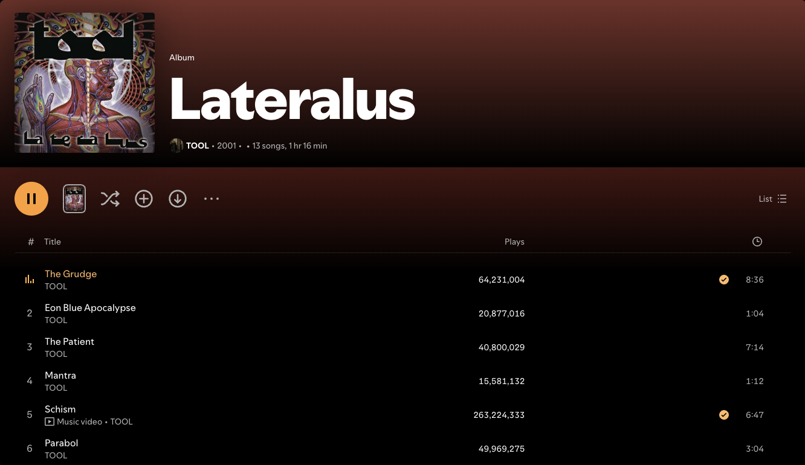

# Catthode for Spicetify

> **From CRT to OLED.** Bringing warmth back to a world of cold themes. [cattho.de](https://cattho.de/)

A warm, true-black Spotify theme for [Spicetify](https://spicetify.app/), with a low-maintenance CSS layer and one focused Catthode color scheme.



## Install from GitHub

1. Download or clone this repository.
2. Copy the `Catthode` folder into Spicetify's `Themes` directory.
3. Apply it:

```sh
spicetify config current_theme Catthode color_scheme Catthode
spicetify apply
```

The theme directory is usually `~/.config/spicetify/Themes` on macOS/Linux and `%appdata%\spicetify\Themes` on Windows.

## Marketplace

The public repository is prepared for Spicetify's community Marketplace: it carries the `spicetify-themes` topic and the root `manifest.json` contains the catalog metadata. Catthode has been visually checked in Spotify 1.2.99.317 with Spicetify 2.45.0 on macOS. The preview above is a crop of the public Lateralus album view; it excludes the library rail, account avatar, device name, recommendations, and notifications.

## nix-darwin

The Catthode nix-darwin setup links the checked-in `Catthode` files into `~/.config/spicetify/Themes/Catthode`, keeps `current_theme`, `color_scheme`, and the injection settings selected, creates a backup when needed, and runs `spicetify apply --no-restart` as the logged-in user during activation. It skips the patch while Spotify is running and prints the manual command to run after quitting it. Applying changes Spotify's app bundle in place, so Spotify updates may require another backup/apply cycle.

## Remove

```sh
spicetify config current_theme ""
spicetify apply
```

Then delete only the copied `Catthode` theme folder.

## License

MIT
