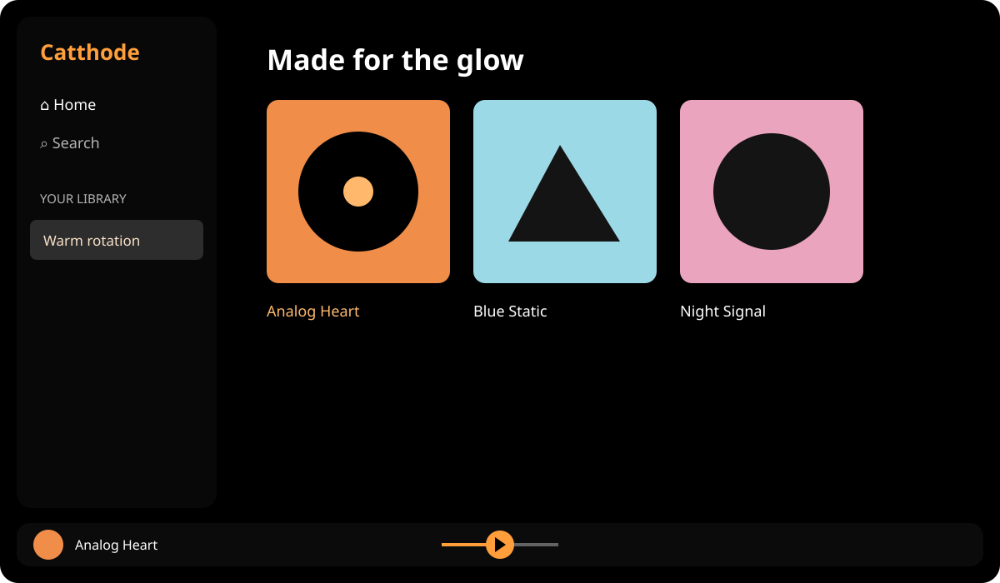

# Catthode for Spicetify

> **From CRT to OLED.** Bringing warmth back to a world of cold themes. [cattho.de](https://cattho.de/)

A warm, true-black Spotify theme for [Spicetify](https://spicetify.app/), with a low-maintenance CSS layer and one focused Catthode color scheme.



## Install from GitHub

1. Download or clone this repository.
2. Copy the `Catthode` folder into Spicetify's `Themes` directory.
3. Apply it:

```sh
spicetify config current_theme Catthode color_scheme Catthode
spicetify apply
```

The theme directory is usually `~/.config/spicetify/Themes` on macOS/Linux and `%appdata%\spicetify\Themes` on Windows.

## Marketplace

The root `manifest.json` contains the metadata used by Spicetify's community theme catalog. Catthode has been visually checked in Spotify 1.2.99.317 with Spicetify 2.45.0 on macOS. The catalog currently uses the repository-native preview above; a privacy-safe client screenshot remains a documentation follow-up.

Spotify-generated artwork and promotional surfaces can retain Spotify's own dynamic colors. Catthode does not patch Spicetify or Spotify to override those app-owned assets.

## Remove

```sh
spicetify config current_theme ""
spicetify apply
```

Then delete only the copied `Catthode` theme folder.

## License

MIT
